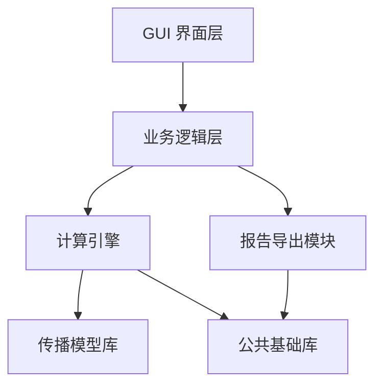
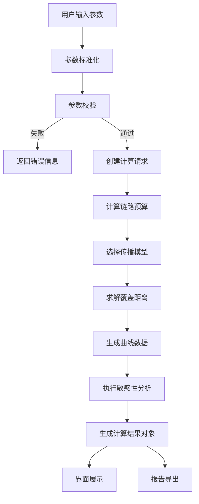

# RT-TETRA Cover Studio 系统总体设计说明书

> 文档编号：RTCS-SDD-002
>
> 项目名称：RT-TETRA Cover Studio（轨道交通 TETRA 覆盖分析平台）
>
> 文档类型：System Design Document（SDD）
>
> 当前版本：V1.0
>
> 编写日期：2026-07
>
> 文档状态：Draft

---

## 修订记录

| 版本 | 日期 | 作者 | 修订内容 |
| --- | --- | --- | --- |
| V1.0 | 2026-07 | 颜文学 | 初始版本 |
| V1.0-Draft | 2026-07-09 | Codex | 补全总体架构、功能模块、数据流、接口、异常、日志、非功能和开发规范 |

---

## 目录

1. 文档说明
2. 系统总体概述
3. 软件总体架构
4. 功能模块设计
5. 数据流程设计
6. 计算引擎设计
7. 数据结构设计
8. 模块接口设计
9. GUI 设计
10. 日志设计
11. 异常处理设计
12. 软件扩展设计
13. 非功能设计
14. 开发规范
15. 总结

---

# 第1章 文档说明

## 1.1 编写目的

本文档用于描述 RT-TETRA Cover Studio 的系统总体设计方案。

主要目标：

- 明确软件总体架构；
- 规范功能模块职责；
- 定义模块调用关系；
- 定义数据流、计算流和结果结构；
- 为后续编码、测试和维护提供依据；
- 为后续版本扩展预留清晰边界。

本文档是 V1.0 开发阶段的核心设计依据。后续编码应优先遵循本文档。

## 1.2 项目背景

轨道交通 TETRA 数字集群无线系统广泛应用于地铁、市域铁路、轻轨、有轨电车等通信系统。

在工程设计、方案论证、招投标和技术交流过程中，经常需要快速完成：

- 单基站覆盖距离估算；
- 无线链路预算；
- 路径损耗分析；
- 接收电平和 RSSI 计算；
- 覆盖曲线绘制；
- 计算报告生成。

传统无线规划软件功能强大，但成本高、操作复杂，不适合日常快速测算。因此本项目建设轻量化、专业化、可追溯的 TETRA 覆盖分析工具。

## 1.3 建设目标

V1.0 目标是完成单基站覆盖分析软件。

功能目标：

- 参数输入；
- 链路预算；
- 传播模型计算；
- 最大覆盖距离求解；
- RSSI 曲线生成；
- Path Loss 曲线生成；
- 参数敏感性分析；
- 计算过程展示；
- Word/PDF 报告导出。

性能目标：

- 单次计算时间不超过 3 秒；
- 支持 Windows 10/11；
- 支持离线运行；
- 支持双精度浮点计算；
- 相同输入得到可重复结果。

## 1.4 适用范围

本软件适用于：

- 城市轨道交通；
- 市域铁路；
- 地铁；
- 轻轨；
- 有轨电车；
- TETRA 数字集群专网。

V1.0 支持场景：

| 场景 | 传播模型 |
| --- | --- |
| 地下站厅、站台 | ITU Indoor |
| 隧道 | Tunnel Model |
| 350/380/400 MHz 地面 | Low-Band Calibrated Ground |
| 800/860 MHz 城市地面 | COST231-Walfisch-Ikegami |
| 高架 | 所选地面模型 + Viaduct Calibration |

V1.0 暂不支持：

- GIS 地图；
- 多站联合覆盖；
- 热力图；
- 自动站址优化；
- 数据库；
- 项目管理功能。

## 1.5 参考标准

国际标准：

- ITU-R P.1238 Indoor Propagation；
- COST231 Walfisch-Ikegami Model；
- Friis Transmission Equation。

国内标准：

- GB/T 8567《计算机软件文档编制规范》；
- GB/T 25000《系统与软件工程 软件产品质量要求与评价（SQuaRE）》。

工程资料：

- TETRA 系统设计规范；
- 城市轨道交通无线通信设计规范；
- 企业工程设计经验参数库。

## 1.6 名词解释

| 缩写 | 含义 |
| --- | --- |
| EIRP | 等效全向辐射功率 |
| RSSI | 接收信号强度指示 |
| Path Loss | 路径损耗 |
| Link Budget | 链路预算 |
| GUI | 图形用户界面 |
| SDD | 系统总体设计说明书 |
| PRD | 产品需求文档 |

---

# 第2章 系统总体概述

## 2.1 系统定位

RT-TETRA Cover Studio 是面向轨道交通无线通信专业的覆盖分析软件。

系统定位：

- 工程设计辅助工具；
- 覆盖分析计算平台；
- 无线传播模型验证平台；
- 设计计算书自动生成平台；
- 后续覆盖规划平台的计算核心。

V1.0 只完成单基站覆盖分析。后续版本可扩展多基站联合覆盖、GIS 地图、覆盖优化和智能站址推荐。

## 2.2 系统总体目标

系统通过统一计算引擎完成覆盖分析。

输入：

- 无线参数；
- 基站参数；
- 手台参数；
- 场景参数；
- 工程裕度；
- 报告配置。

输出：

- EIRP；
- 最大允许路径损耗；
- 最大覆盖距离；
- 距离-RSSI 数据；
- 距离-Path Loss 数据；
- 覆盖等级；
- 参数敏感性分析；
- 可导出的计算报告。

## 2.3 系统边界

V1.0 系统边界如下：

| 类别 | 范围 |
| --- | --- |
| 基站数量 | 单基站 |
| 场景数量 | 单次计算选择一个场景 |
| 计算模式 | 单次计算 |
| 数据存储 | 文件级配置和导出，不使用数据库 |
| 地理信息 | 不接入 GIS |
| 输出形式 | 界面展示、图表、Word/PDF 报告 |

---

# 第3章 软件总体架构

## 3.1 架构设计原则

系统遵循以下原则：

- 单一职责：每个模块只负责一个明确领域；
- 统一入口：所有计算通过 Calculation Engine 调度；
- 低耦合：GUI 不直接调用传播模型；
- 可追溯：计算结果必须包含公式、参数代入和中间值；
- 可测试：核心计算模块必须可脱离 GUI 独立测试；
- 可扩展：新增传播模型不应影响 GUI 和报告模块。

## 3.2 总体分层架构



## 3.3 分层职责

| 层级 | 职责 |
| --- | --- |
| GUI 界面层 | 参数输入、参数校验提示、结果展示、图表展示、导出入口 |
| 业务逻辑层 | 组织计算请求、调用计算引擎、调用报告导出、管理界面状态 |
| 计算引擎 | 控制链路预算、模型选择、路径损耗计算、覆盖距离求解、敏感性分析 |
| 传播模型库 | 实现 ITU Indoor、Tunnel、COST231-WI 等传播模型 |
| 公共基础库 | 单位转换、数学工具、数据校验、日志、常量定义 |
| 报告导出模块 | 根据计算结果生成 Word/PDF 报告 |

## 3.4 模块依赖规则

允许依赖：

- GUI 调用业务逻辑层；
- 业务逻辑层调用计算引擎和报告导出；
- 计算引擎调用传播模型库和公共基础库；
- 报告导出调用公共基础库。

禁止依赖：

- GUI 直接调用传播模型；
- 传播模型反向调用 GUI；
- 传播模型直接生成报告；
- 公共基础库依赖业务模块。

---

# 第4章 功能模块设计

## 4.1 模块划分

V1.0 模块划分如下：

| 模块 | 目录建议 | 主要职责 |
| --- | --- | --- |
| 参数输入模块 | `src/ui` 或 `src/app` | 接收用户输入并组织计算请求 |
| 参数校验模块 | `src/common` | 校验频率、功率、高度、损耗等输入 |
| 链路预算模块 | `src/engine` | 计算 EIRP 和最大允许路径损耗 |
| 传播模型模块 | `src/models` | 计算不同场景下的路径损耗 |
| 覆盖距离求解模块 | `src/engine` | 通过数值迭代求解最大覆盖距离 |
| RSSI 计算模块 | `src/engine` | 生成距离-RSSI 数据 |
| 曲线数据模块 | `src/engine` | 生成图表所需数据序列 |
| 敏感性分析模块 | `src/engine` | 分析关键参数变化对覆盖距离的影响 |
| 报告导出模块 | `src/report` | 生成 Word/PDF 报告 |
| 日志模块 | `src/common` | 记录运行、计算和异常日志 |

## 4.2 参数输入模块

输入内容：

- 工作频率；
- 基站/手台发射功率（W）；
- 基站天线增益；
- 馈线损耗；
- 基站其他损耗；
- 手台天线增益；
- 基站/手台接收灵敏度（dBm）；
- 人体损耗和基站分集增益；
- 基站高度；
- 手台高度；
- 场景类型；
- 场景专用参数；
- 阴影衰落标准差、边缘覆盖率、干扰余量和穿透损耗。

输出：

- 标准化后的 `CalculationInput`。

## 4.3 参数校验模块

校验要求：

- 必填项不能为空；
- 数值必须在合理工程范围内；
- 单位必须统一；
- 场景专用参数必须与场景类型匹配；
- 接收灵敏度应为 dBm；
- 损耗和裕度不能为负数。

校验失败时返回明确错误信息，不进入计算引擎。

## 4.4 链路预算模块

计算公式：

```text
P_dBm = 10 × log10(P_W × 1000)
EIRP_BS = P_BS_dBm + G_BS - L_feeder - L_other
EIRP_MS = P_MS_dBm + G_MS - L_body
M_shadow = Z(p) × σ
MAPL_DL = EIRP_BS - Req_Rx_MS
MAPL_UL = EIRP_MS - Req_Rx_BS
System_MAPL = min(MAPL_DL, MAPL_UL)
```

模块输出：

- 基站/手台 EIRP；
- 阴影衰落余量和两端最低要求接收功率；
- 上下行 MAPL、系统 MAPL 和受限链路；
- 公式说明；
- 参数代入过程。

## 4.5 传播模型模块

传播模型统一输入：

- 频率；
- 距离；
- 天线高度；
- 场景参数；
- 工程修正项。

传播模型统一输出：

- 路径损耗；
- 模型名称；
- 公式来源；
- 中间计算项；
- 适用范围说明。

## 4.6 覆盖距离求解模块

求解目标：

```text
PathLoss(distance) = MaxPathLoss
```

建议采用二分法或受控迭代法。

输出内容：

- 最大覆盖距离；
- 迭代次数；
- 收敛状态；
- 每轮关键迭代记录；
- 最终 Path Loss 与 Max Path Loss 差值。

## 4.7 曲线数据模块

生成两类曲线数据：

- 距离-Path Loss 曲线；
- 距离-RSSI 曲线。

曲线数据不直接依赖 GUI 绘图库，应以通用数据结构输出，供 GUI 和报告模块复用。

## 4.8 参数敏感性分析模块

V1.0 默认分析参数：

- 发射功率；
- 天线增益；
- 基站高度；
- 工程裕度。

输出：

- 参数名称；
- 调整值；
- 原覆盖距离；
- 新覆盖距离；
- 覆盖距离变化量；
- 影响方向。

## 4.9 报告导出模块

报告内容：

- 输入参数；
- 链路预算结果；
- 传播模型计算过程；
- 覆盖距离求解过程；
- RSSI 曲线；
- Path Loss 曲线；
- 参数敏感性分析；
- 最终结论。

报告模块只接收 `CalculationResult`，不重新计算。

---

# 第5章 数据流程设计

## 5.1 主数据流程



## 5.2 数据流说明

| 阶段 | 输入 | 输出 |
| --- | --- | --- |
| 参数输入 | 用户输入 | 原始参数 |
| 参数标准化 | 原始参数 | 统一单位参数 |
| 参数校验 | 统一单位参数 | 校验结果 |
| 链路预算 | 计算输入 | EIRP、最大允许路径损耗 |
| 传播计算 | 距离、频率、场景参数 | Path Loss |
| 覆盖求解 | 最大允许路径损耗、传播模型 | 最大覆盖距离 |
| 曲线生成 | 距离范围、模型 | 曲线数据点 |
| 敏感性分析 | 基准输入、扰动参数 | 敏感性结果 |
| 报告导出 | 计算结果对象 | Word/PDF 文件 |

## 5.3 数据一致性要求

- GUI 展示、报告导出、测试断言必须使用同一份计算结果；
- 报告模块不得自行重新计算结果；
- 曲线数据和最终覆盖距离必须来自同一次计算；
- 所有输入单位在进入计算引擎前必须统一。

---

# 第6章 计算引擎设计

## 6.1 计算引擎职责

Calculation Engine 是核心调度模块。

职责：

- 接收 `CalculationInput`；
- 调用参数校验；
- 计算链路预算；
- 按场景选择传播模型；
- 求解最大覆盖距离；
- 生成曲线数据；
- 生成敏感性分析；
- 汇总 `CalculationResult`。

## 6.2 计算流程

```text
输入参数
↓
参数校验
↓
计算 EIRP
↓
计算最大允许路径损耗
↓
选择传播模型
↓
迭代求解覆盖距离
↓
生成 RSSI 和 Path Loss 曲线数据
↓
执行参数敏感性分析
↓
输出计算结果对象
```

## 6.3 模型选择规则

| 场景类型 | 模型 |
| --- | --- |
| underground | ITU Indoor |
| tunnel | Tunnel Model |
| ground | 显式选择低频标定模型或 COST231-WI |
| viaduct | 所选地面模型 + 高架标定修正 |

模型选择应通过工厂函数或注册表完成，避免在 GUI 中写条件分支。

## 6.4 覆盖距离求解策略

建议流程：

1. 设置最小距离和最大搜索距离；
2. 分别计算两端 Path Loss；
3. 若最大搜索距离仍满足覆盖要求，返回“达到搜索上限”状态；
4. 若最小距离已不满足覆盖要求，返回“无有效覆盖”状态；
5. 使用二分法迭代；
6. 当误差小于阈值或达到最大迭代次数时停止。

建议参数：

| 参数 | 建议值 |
| --- | --- |
| 最小距离 | 1 m |
| 最大搜索距离 | 50000 m |
| 距离误差阈值 | 1 m |
| 最大迭代次数 | 100 |

## 6.5 计算过程追溯

每一步计算应记录：

- 步骤名称；
- 使用公式；
- 公式来源；
- 输入参数；
- 参数代入；
- 计算结果；
- 单位。

追溯信息用于：

- GUI 过程展示；
- Word/PDF 报告；
- 测试排查；
- 工程复核。

---

# 第7章 数据结构设计

## 7.1 CalculationInput

`CalculationInput` 表示一次计算的完整输入。

建议字段：

| 字段 | 类型 | 说明 |
| --- | --- | --- |
| frequency_mhz | float | 工作频率，单位 MHz |
| base_tx_power_w | float | 基站发射功率，单位 W |
| mobile_tx_power_w | float | 手台发射功率，单位 W |
| base_antenna_gain_dbi | float | 基站天线增益 |
| base_feeder_loss_db | float | 基站馈线损耗 |
| base_other_loss_db | float | 基站其他损耗 |
| mobile_antenna_gain_dbi | float | 手台天线增益 |
| mobile_receiver_sensitivity_dbm | float | 手台接收灵敏度 |
| base_receiver_sensitivity_dbm | float | 基站接收灵敏度 |
| base_height_m | float | 基站天线高度 |
| mobile_height_m | float | 手台高度 |
| scenario_type | string | 场景类型 |
| scenario_params | dict | 场景专用参数 |
| shadow_fading_std_db | float | 阴影衰落标准差 |
| edge_coverage_probability_pct | float | 边缘覆盖地点概率 |
| interference_margin_db | float | 干扰余量 |
| penetration_loss_db | float | 穿透损耗 |

## 7.2 LinkBudgetResult

| 字段 | 类型 | 说明 |
| --- | --- | --- |
| base_eirp_dbm / mobile_eirp_dbm | float | 基站/手台 EIRP |
| downlink_mapl_db / uplink_mapl_db | float | 上下行 MAPL |
| max_path_loss_db | float | 系统 MAPL |
| limiting_link | string | 受限链路 |
| steps | list | 公式和代入过程 |

## 7.3 PropagationResult

| 字段 | 类型 | 说明 |
| --- | --- | --- |
| model_name | string | 模型名称 |
| distance_m | float | 计算距离 |
| path_loss_db | float | 路径损耗 |
| intermediate_values | dict | 中间计算量 |
| formula_source | string | 公式来源 |

## 7.4 CurvePoint

| 字段 | 类型 | 说明 |
| --- | --- | --- |
| distance_m | float | 距离 |
| path_loss_db | float | 路径损耗 |
| rssi_dbm | float | 接收电平 |

## 7.5 CalculationResult

`CalculationResult` 是 GUI 展示和报告导出的唯一结果来源。

建议字段：

| 字段 | 类型 | 说明 |
| --- | --- | --- |
| input | CalculationInput | 原始计算输入 |
| link_budget | LinkBudgetResult | 链路预算结果 |
| coverage_distance_m | float | 最大覆盖距离 |
| coverage_level | string | 覆盖等级 |
| iteration_steps | list | 覆盖距离求解过程 |
| curve_points | list[CurvePoint] | 曲线数据 |
| sensitivity | list | 敏感性分析结果 |
| calculation_steps | list | 全过程追溯 |
| warnings | list | 计算警告 |

---

# 第8章 模块接口设计

## 8.1 计算引擎接口

```python
def calculate_coverage(input_data: CalculationInput) -> CalculationResult:
    """执行一次完整覆盖计算。"""
```

接口要求：

- 不依赖 GUI；
- 不直接写文件；
- 输入不合法时返回明确异常或校验错误；
- 输出完整计算过程。

## 8.2 传播模型接口

```python
class PropagationModel:
    name: str

    def calculate_path_loss(self, input_data: CalculationInput, distance_m: float) -> PropagationResult:
        """计算指定距离下的路径损耗。"""
```

所有传播模型必须实现同一接口。

## 8.3 报告导出接口

```python
def export_report(result: CalculationResult, output_path: str, format_type: str) -> str:
    """根据计算结果导出报告，返回生成文件路径。"""
```

接口要求：

- 不重新计算；
- 支持 Word/PDF 扩展；
- 输出失败时返回明确错误。

## 8.4 参数校验接口

```python
def validate_input(input_data: CalculationInput) -> list[str]:
    """返回校验错误列表，空列表表示通过。"""
```

校验模块只负责发现问题，不负责修正业务输入。

---

# 第9章 GUI 设计

## 9.1 GUI 设计目标

GUI 面向工程设计人员，重点是清晰、稳定、可复核。

设计目标：

- 参数输入明确；
- 场景切换直观；
- 计算结果醒目；
- 计算过程可展开查看；
- 曲线可直接用于方案说明；
- 报告导出入口清晰。

## 9.2 页面结构

V1.0 建议采用单窗口多区域布局：

| 区域 | 内容 |
| --- | --- |
| 参数区 | 双向无线参数、覆盖设计参数、场景参数 |
| 操作区 | 计算、重置、导出 |
| 结果区 | 覆盖距离、上下行 MAPL、受限链路、下行 RSSI、传播模型 |
| 过程区 | 公式、代入过程、中间计算 |
| 图表区 | RSSI 曲线、Path Loss 曲线 |
| 提示区 | 校验错误、警告、导出状态 |

## 9.3 输入控件要求

- 数值参数使用输入框；
- 场景类型使用下拉选择；
- 频段可使用下拉选择或数值输入；
- 功率输入使用 W，灵敏度保留 dBm，单位放在左侧标签；
- 输入框只显示数值，不显示单位后缀；
- 场景参数根据场景类型动态显示；
- 输入错误应在计算前提示。

## 9.4 结果展示要求

结果展示至少包含：

- 最大覆盖距离；
- 受限链路；
- 上下行 MAPL 和系统 MAPL；
- 覆盖边界 RSSI；
- 覆盖等级；
- 使用的传播模型。

计算过程展示至少包含：

- 基站/手台 EIRP 公式和代入；
- 阴影衰落余量与两端最低要求接收功率；
- 上下行 MAPL、系统 MAPL 和受限链路；
- 传播模型来源；
- 覆盖距离迭代过程。

---

# 第10章 日志设计

## 10.1 日志目标

日志用于定位问题和复核计算，不作为正式报告内容。

记录内容：

- 程序启动和关闭；
- 计算请求摘要；
- 参数校验失败；
- 模型选择；
- 计算完成；
- 报告导出；
- 异常信息。

## 10.2 日志级别

| 级别 | 用途 |
| --- | --- |
| DEBUG | 开发调试信息 |
| INFO | 正常运行信息 |
| WARNING | 可继续运行的异常情况 |
| ERROR | 当前操作失败 |

## 10.3 日志要求

- 日志不得记录敏感个人信息；
- 日志应包含时间、级别、模块、消息；
- 计算异常必须记录输入摘要和错误原因；
- 日志文件应放在可配置目录，避免污染源码目录。

---

# 第11章 异常处理设计

## 11.1 异常分类

| 异常类型 | 示例 | 处理方式 |
| --- | --- | --- |
| 输入异常 | 频率为空、损耗为负数 | 阻止计算并提示用户 |
| 场景异常 | 场景参数缺失 | 阻止计算并提示缺失项 |
| 模型异常 | 模型不支持当前参数 | 返回明确错误 |
| 收敛异常 | 覆盖距离求解未收敛 | 返回警告和当前最优结果 |
| 导出异常 | 文件被占用、路径不可写 | 提示用户更换路径 |
| 系统异常 | 未预期错误 | 记录日志并提示失败 |

## 11.2 输入异常处理

输入异常必须在进入计算引擎前发现。

示例：

- 工作频率不在支持范围；
- 接收灵敏度不是负值；
- 馈线损耗小于 0；
- 场景为隧道但缺少隧道宽度；
- 工程裕度小于 0。

## 11.3 计算异常处理

计算过程中不得静默失败。

要求：

- 模型不适用时给出原因；
- 迭代不收敛时记录迭代次数；
- 达到最大搜索距离时返回状态；
- 所有异常应能被测试复现。

---

# 第12章 软件扩展设计

## 12.1 新增传播模型

新增传播模型步骤：

1. 新增模型类；
2. 实现统一传播模型接口；
3. 注册模型名称和适用场景；
4. 添加模型单元测试；
5. 更新传播模型设计文档。

不得修改 GUI 调用逻辑。

## 12.2 新增场景

新增场景步骤：

1. 定义场景参数；
2. 绑定适用传播模型；
3. 增加参数校验规则；
4. 增加界面输入项；
5. 增加示例和测试用例。

## 12.3 新增导出格式

新增导出格式应扩展报告导出模块。

要求：

- 复用 `CalculationResult`；
- 不修改计算引擎；
- 不重新计算结果；
- 增加导出测试。

## 12.4 后续版本方向

| 版本 | 方向 |
| --- | --- |
| V1.0 | 单基站覆盖计算 |
| V2.0 | 多基站联合覆盖 |
| V3.0 | GIS 地图显示 |
| V4.0 | 覆盖优化 |
| V5.0 | AI 辅助规划 |

---

# 第13章 非功能设计

## 13.1 性能要求

- 单次计算时间不超过 3 秒；
- 常规参数下曲线生成不应造成明显卡顿；
- 报告导出失败不应影响计算结果；
- 核心计算应可在无 GUI 环境下运行。

## 13.2 准确性要求

- 所有单位必须明确；
- 所有公式必须可追溯；
- 浮点误差应在测试中设置合理容差；
- 示例用例应保留预期结果。

## 13.3 可维护性要求

- 核心计算逻辑不得写在 GUI 事件代码中；
- 传播模型之间不得互相依赖；
- 公共公式和常量应集中管理；
- 测试应覆盖关键公式和边界输入。

## 13.4 可移植性要求

V1.0 以 Windows 10/11 为主要运行环境。

核心计算模块应尽量避免平台相关依赖，便于后续扩展到命令行、Web 或其他 GUI 形态。

## 13.5 安全性要求

- 不执行用户输入的脚本；
- 导出路径必须校验；
- 文件覆盖应提示用户；
- 报告文件名应避免非法字符。

---

# 第14章 开发规范

## 14.1 目录规范

```text
src/
  app/        # 业务逻辑
  engine/     # 计算引擎
  models/     # 传播模型
  report/     # 报告导出
  ui/         # GUI
  common/     # 公共工具

tests/
  test_link_budget.py
  test_models.py
  test_engine.py
  test_validation.py
```

实际目录可在开发时根据技术栈微调，但模块职责不应混淆。

## 14.2 命名规范

- Python 文件名使用小写加下划线；
- 类名使用 PascalCase；
- 函数和变量使用 snake_case；
- 单位写入变量名，如 `frequency_mhz`、`path_loss_db`；
- 布尔变量使用 `is_`、`has_`、`can_` 前缀。

## 14.3 测试规范

新增计算功能必须配套测试。

最低测试范围：

- 正常输入；
- 边界输入；
- 非法输入；
- 单位转换；
- 传播模型结果；
- 覆盖距离求解收敛；
- 报告导出失败处理。

## 14.4 文档同步规范

以下变更必须同步更新文档：

- 新增传播模型；
- 修改计算公式；
- 修改输入参数；
- 修改 V1.0 范围；
- 新增导出格式；
- 修改目录结构。

优先更新：

- `PROJECT_INDEX.md`；
- `docs/01_产品开发项目需求书.md`；
- `docs/02_系统总体设计.md`；
- 对应专题设计文档。

---

# 第15章 总结

RT-TETRA Cover Studio V1.0 采用分层架构，以计算引擎为核心，以传播模型库为基础，以 GUI 展示和报告导出为外部能力。

本设计明确了：

- V1.0 系统边界；
- 核心模块职责；
- 数据流和计算流；
- 统一结果对象；
- 传播模型接口；
- 报告导出边界；
- 异常、日志、测试和扩展要求。

后续开发应优先实现最小计算闭环：

```text
参数输入
↓
链路预算
↓
传播模型
↓
覆盖距离求解
↓
计算结果输出
```

在该闭环通过测试后，再继续开发 GUI、曲线绘制和报告导出。
