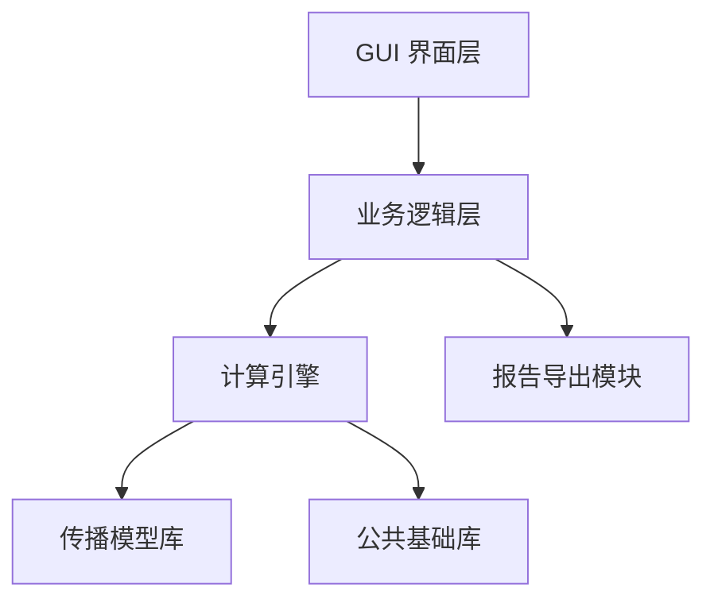
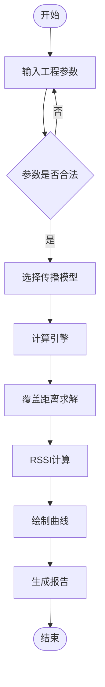

1. RT-TETRA Cover Studio

    # 系统总体设计说明书

    > 文档编号：RTCS-SDD-002
    >
    > 项目名称：RT-TETRA Cover Studio（轨道交通 TETRA 覆盖分析平台）
    >
    > 文档类型：System Design Document（SDD）
    >
    > 当前版本：V1.0
    >
    > 编写日期：2026-07
    >
    > 文档状态：Draft

    ---

    # 修订记录

    | 版本 | 日期    | 作者   | 修订内容 |
    | ---- | ------- | ------ | -------- |
    | V1.0 | 2026-07 | 颜文学 | 初始版本 |

    ---

    # 目录

    1. 文档说明

    2. 系统总体概述

    3. 软件总体架构

    4. 功能模块设计

    5. 数据流程设计

    6. 计算引擎设计

    7. 数据结构设计

    8. 模块接口设计

    9. GUI设计

    10. 日志设计

    11. 异常处理设计

    12. 软件扩展设计

    13. 非功能设计

    14. 开发规范

    15. 总结

    ---

    # 第1章 文档说明

    ## 1.1 编写目的

    本文档用于描述 **RT-TETRA Cover Studio** 软件的总体设计方案。

    其主要目标包括：

    - 明确软件总体架构；
    - 规范各功能模块职责；
    - 定义模块间调用关系；
    - 定义数据流与计算流程；
    - 为后续编码、测试及维护提供统一依据；
    - 为后续版本扩展提供架构基础。

    本文档是整个项目的核心设计文档，后续所有开发工作均应以本文档为准。

    ---

    ## 1.2 项目背景

    轨道交通 TETRA 数字集群无线系统广泛应用于城市轨道交通通信系统。

    在方案设计、工程投标、施工设计及科研过程中，经常需要完成以下工作：

    - 单基站覆盖距离估算；
    - 无线链路预算；
    - RSSI 计算；
    - 路径损耗分析；
    - 覆盖曲线绘制；
    - 技术方案比选。

    目前常用的无线规划软件（如 Atoll、ICS Telecom）功能强大，但价格昂贵、操作复杂，不适用于日常工程计算。

    因此，本项目拟开发一套轻量化、专业化的轨道交通 TETRA 覆盖分析软件，作为工程设计和方案论证工具，并为后续多基站覆盖分析奠定基础。

    ---

    ## 1.3 建设目标

    本项目 V1.0 的目标如下：

    ### 功能目标

    实现单基站覆盖分析，包括：

    - 链路预算计算；
    - 路径损耗计算；
    - 覆盖距离计算；
    - RSSI 曲线生成；
    - Path Loss 曲线生成；
    - 参数敏感性分析；
    - 计算过程可追溯；
    - Word/PDF 报告导出。

    ### 性能目标

    - 单次计算时间 ≤ 3 秒；
    - 支持 Windows 10/11；
    - 支持离线运行；
    - 支持双精度浮点计算；
    - 结果可重复。

    ### 可扩展目标

    软件采用模块化架构设计，后续支持：

    - 多基站联合覆盖；
    - GIS 地图显示；
    - 覆盖热力图；
    - 自动站址优化；
    - AI 辅助规划；
    - LTE/MCX/5G 专网扩展。

    ---

    ## 1.4 适用范围

    本软件适用于以下工程场景：

    - 城市轨道交通；
    - 市域铁路；
    - 地铁；
    - 轻轨；
    - 有轨电车；
    - TETRA 数字集群专网。

    支持以下典型环境：

    - 地下站厅；
    - 地下站台；
    - 隧道；
    - 地面区段；
    - 高架区段。

    ---

    ## 1.5 参考标准

    ### 国际标准

    - ITU-R P.1238（Indoor Propagation）
    - COST231 Walfisch-Ikegami Model
    - Friis Transmission Equation

    ### 国内标准

    - GB/T 8567《计算机软件文档编制规范》
    - GB/T 25000《系统与软件工程 软件产品质量要求与评价（SQuaRE）》

    ### 工程资料

    - TETRA 系统设计规范
    - 城市轨道交通无线通信设计规范
    - 企业工程设计经验参数库（后续建立）

    ---

    ## 1.6 名词解释

    | 缩写        | 含义                      |
    | ----------- | ------------------------- |
    | EIRP        | 等效全向辐射功率          |
    | RSSI        | 接收信号强度指示          |
    | Path Loss   | 路径损耗                  |
    | Link Budget | 链路预算                  |
    | TETRA       | Terrestrial Trunked Radio |
    | GUI         | 图形用户界面              |
    | SDD         | 软件总体设计说明书        |
    | PRD         | 产品需求文档              |

    ---

    # 第2章 系统总体概述

# 第2章 系统总体概述

## 2.1 系统定位

RT-TETRA Cover Studio 是一套面向轨道交通无线通信专业的覆盖分析软件。

软件定位于：

- 工程设计辅助工具
- 覆盖分析计算平台
- 无线传播模型验证平台
- 设计计算书自动生成平台
- 后续覆盖规划平台的计算核心

软件采用模块化架构设计。

V1.0 完成单基站覆盖分析。

V2 开始支持多基站联合覆盖。

V3 支持 GIS 地图。

V4 支持覆盖优化。

V5 支持 AI 智能站址推荐。

---

## 2.2 系统总体目标

系统总体目标如下：

### 功能目标

实现：

- 参数输入
- 链路预算
- 传播模型计算
- 覆盖距离计算
- RSSI 曲线
- Path Loss 曲线
- 参数敏感性分析
- Word/PDF 报告导出

---

### 技术目标

软件采用统一计算引擎。

所有传播模型采用统一接口。

所有图形采用统一绘图接口。

所有导出采用统一报告接口。

保证：

- 高内聚
- 低耦合
- 易扩展

---

## 2.3 软件总体架构

整个软件采用五层架构。

---

各层职责如下：

| 层级     | 职责                   |
| -------- | ---------------------- |
| GUI      | 参数输入、结果显示     |
| 业务层   | 调度各功能模块         |
| 计算引擎 | 控制整个计算流程       |
| 模型层   | 各传播模型实现         |
| 公共库   | 数学、单位转换、日志等 |
| 报告模块 | Word/PDF 导出          |

整个软件禁止 GUI 直接调用传播模型。

所有计算必须经过 Calculation Engine。

---

## 2.4 软件运行流程

软件整体运行流程如下：

---

## 2.5 软件特点

### ① 模块独立

每个模块均可独立开发。

例如：

Propagation Model

无需了解 GUI。

GUI

无需了解传播模型。

---

### ② 统一计算入口

软件所有计算均通过：

Calculation Engine

完成。

禁止：

GUI

↓

Propagation

直接调用。

---

### ③ 可扩展

新增传播模型时：

仅需新增：

一个 Model。

无需修改：

GUI

无需修改：

Engine。

---

### ④ 工程可追溯

软件记录：

- 输入参数
- 中间计算
- 公式来源
- 参数变化
- 最终结果

形成完整计算链。

---

### ⑤ 可维护

软件采用：

接口 + 工厂模式。

新增：

ECC33

Okumura

3GPP

均无需修改原有代码。

---

# 第3章 软件总体架构

## 3.1 架构设计原则

软件遵循以下原则：

### 单一职责原则（SRP）

每个模块只负责一件事情。

例如：

Link Budget

只负责：

链路预算。

Propagation

只负责：

路径损耗。

Chart

只负责：

绘图。

---

### 开闭原则（OCP）

软件允许：

新增传播模型。

禁止：

修改已有模型。

所有模型均实现统一接口。

---

### 依赖倒置原则（DIP）

Calculation Engine

依赖：

IPropagationModel

而不是：

某一个具体模型。

---

### 高内聚

模块内部高度聚合。

例如：

Tunnel

所有算法全部放在：

TunnelModel。

---

### 低耦合

GUI

不知道：

传播模型。

传播模型

不知道：

GUI。

仅通过：

Engine

通信。