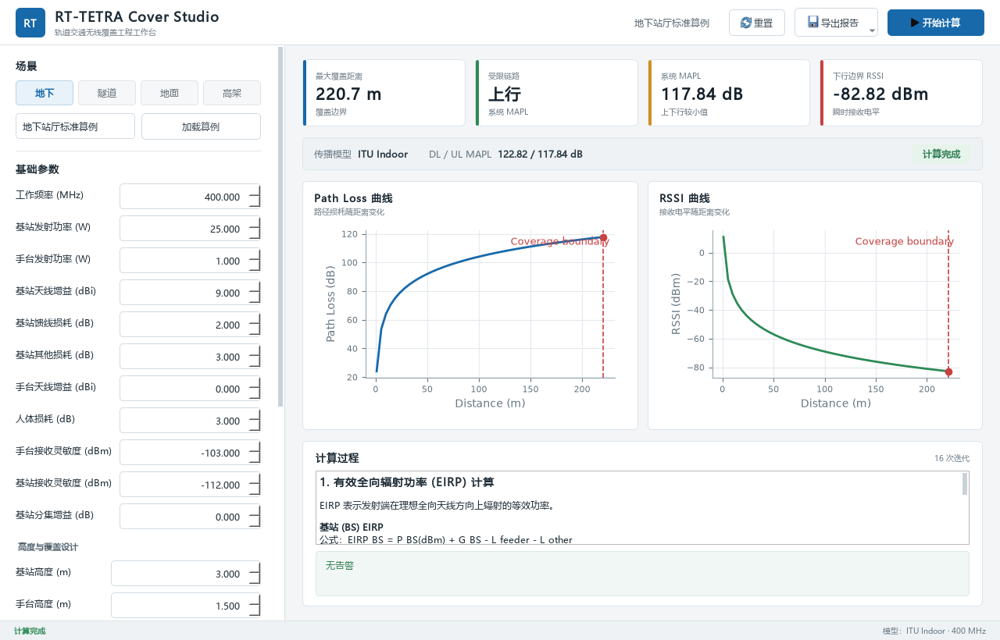

# 05_UI设计规范

> 项目：RT-TETRA Cover Studio
>
> 版本：V1.0 Draft
>
> 状态：已按工程控制台方案校准

---

## 1. 设计目标

V1.0 UI 面向轨道交通无线通信设计人员，优先保证计算输入清晰、结果可复核、报告可导出。

设计原则：

- 工程工具优先，不做营销式界面；
- 参数分组明确；
- 计算结果突出；
- 计算过程可追溯；
- 错误提示直接指出问题；
- 不在界面层实现计算公式。

---

## 2. 页面布局

V1.0 采用“工程控制台”单窗口布局。

```text
顶部：品牌 / 当前算例 / 重置 / 导出报告 / 开始计算
左侧：场景分段选择 / 标准算例 / 基础参数 / 场景参数
右侧上方：四项核心指标 / 模型与 EIRP
右侧中部：Path Loss 与 RSSI 双曲线
右侧下方：计算过程 / 计算提示
底部：状态 / 当前模型与频率
```

实际界面：



响应式规则：

- 1180 px 及以上：四项核心指标单行展示；
- 低于 1180 px：核心指标自动重排为 2×2；
- 最小窗口为 1080×720，内容不足时使用垂直滚动；
- 页面本身不使用横向滚动，计算表格可独立横向滚动。

---

## 3. 参数输入区

参数分组：

| 分组 | 字段 |
| --- | --- |
| 无线参数 | 工作频率、基站/手台发射功率、基站/手台接收灵敏度 |
| 天馈参数 | 基站天线增益、馈线损耗、其他损耗、手台天线增益、人体损耗、分集增益 |
| 高度参数 | 基站高度、手台高度 |
| 场景参数 | 地下、隧道、地面、高架专用参数 |
| 覆盖设计 | 阴影衰落标准差、边缘覆盖率、干扰余量、穿透损耗 |

控件要求：

- 数值使用输入框；
- 场景使用地下、隧道、地面、高架分段按钮；
- 频段可使用下拉框加手动输入；
- 发射功率单位为 W，接收灵敏度单位为 dBm；
- 单位写在左侧标签中，输入框只显示数字；
- 基础参数和场景参数使用一致的左标签、右输入框布局；
- 边缘覆盖率默认 95%，按单侧正态分布地点概率计算；
- 场景切换时只显示相关参数。

---

## 4. 操作按钮

V1.0 基础按钮：

| 按钮 | 行为 |
| --- | --- |
| 计算 | 执行一次完整覆盖计算 |
| 重置 | 恢复默认参数 |
| 导出报告 | 通过菜单选择导出 Word 或 PDF |

按钮状态：

- 参数非法时禁用导出；
- 计算中禁用重复计算；
- 无计算结果时禁用导出。

---

## 5. 结果展示区

核心结果必须优先展示：

- 最大覆盖距离；
- 受限链路；
- 上下行 MAPL 和系统 MAPL；
- 下行覆盖边界 RSSI；
- 使用模型。

最大覆盖距离、受限链路、系统 MAPL 和下行边界 RSSI 使用紧凑指标卡展示；传播模型和上下行 MAPL 使用次级信息条展示。

---

## 6. 计算过程区

计算过程可分步骤展示：

1. 基站/手台 EIRP 计算；
2. 阴影衰落余量和最低要求接收功率；
3. 上下行 MAPL 和受限链路；
4. 当前传播模型公式与中间量；
5. 覆盖距离求解。

每一步展示：

- 公式；
- 参数代入；
- 中间结果；
- 单位；
- 公式来源。

---

## 7. 曲线区

曲线类型：

- Path Loss - Distance；
- RSSI - Distance。

图表要求：

- 横轴为距离；
- 纵轴标明单位；
- 标注覆盖边界；
- 标注最大允许路径损耗或接收灵敏度；
- 图表数据来自计算结果对象。

---

## 8. 错误与提示

错误提示规则：

- 指出具体字段；
- 说明错误原因；
- 给出允许范围或修正建议；
- 不显示技术堆栈给普通用户。

示例：

```text
馈线损耗不能小于 0 dB。
隧道场景必须填写隧道宽度和隧道高度。
```

---

## 9. 报告导出交互

导出前检查：

- 是否已有计算结果；
- 输出路径是否可写；
- 文件是否已存在；
- 文件名是否合法。

导出后提示：

- 成功：显示报告路径；
- 失败：显示失败原因。

---

## 10. UI 与计算边界

UI 层只负责：

- 收集输入；
- 展示结果；
- 展示错误；
- 触发导出。

UI 层不得：

- 直接计算 EIRP；
- 直接调用传播模型；
- 修改计算结果；
- 重新生成报告数据。

---

## 11. 验收标准

V1.0 UI 原型完成时应满足：

- 能输入所有 V1.0 参数；
- 能执行一次计算；
- 能展示核心结果；
- 能展开查看计算过程；
- 能显示两类曲线；
- 能触发 Word/PDF 导出；
- 参数错误时能阻止计算并提示。
